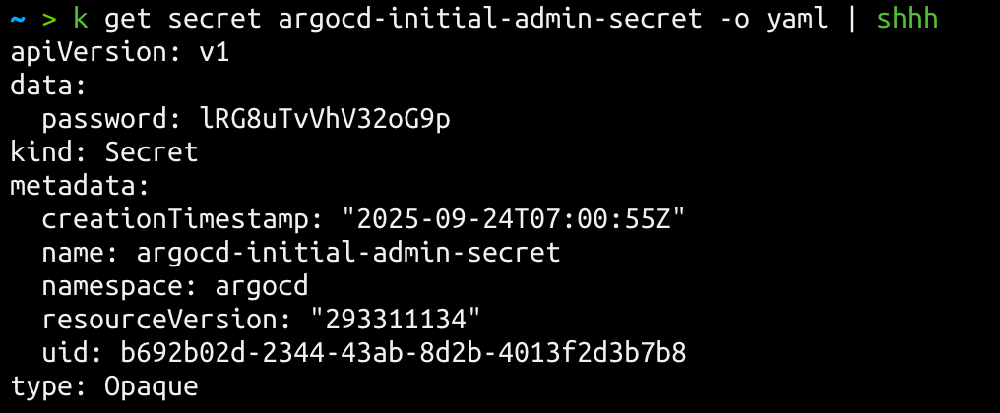

# shhh

A CLI tool to decode base64-encoded Kubernetes secrets.



## Installation

```bash
cargo build --release
sudo cp target/release/shhh /usr/local/bin/
```

Or use the included build script:

```bash
chmod +x build.sh
./build.sh
```

## Usage

Pipe the YAML output of `kubectl get secret` to `shhh`:

```bash
kubectl get secret <secret-name> -o yaml | shhh
```

### Example

```bash
$ kubectl get secret my-credentials -o yaml | shhh
apiVersion: v1
kind: Secret
metadata:
  name: my-credentials
  namespace: default
type: Opaque
data:
  username: admin
  password: supersecret123
```

The tool preserves the original YAML structure and decodes all base64 values in the `data` section inline.

## Error Handling

The tool validates input and provides helpful error messages:

- Running without piped input shows usage instructions
- Non-secret YAML input is rejected with an error
- Secrets without a `data` section are flagged

## Requirements

- Rust (for building)
- kubectl (for fetching secrets)
